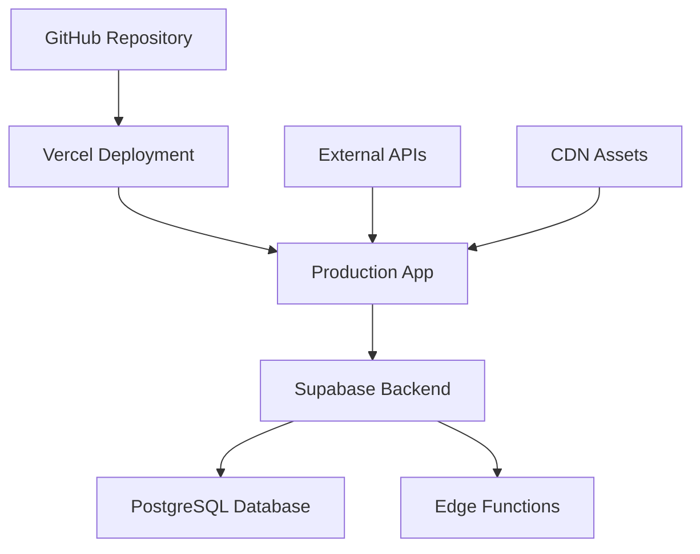

# 🚀 NEXTFAANG Deployment Guide

## 📋 Overview

This guide covers the complete deployment process for NEXTFAANG, from local development to production deployment on Vercel with Supabase backend.

---

## 🏗️ Architecture Overview



### **🔧 Infrastructure Components**
- **Frontend**: React app deployed on Vercel
- **Backend**: Supabase (PostgreSQL + Edge Functions)
- **CDN**: Vercel Edge Network
- **Monitoring**: Vercel Analytics + Supabase Monitoring
- **Domain**: Custom domain with SSL

---

## 🛠️ Prerequisites

### **💻 Development Environment**
- Node.js 18+ and npm/yarn
- Git for version control
- Vercel CLI (optional but recommended)
- Supabase CLI (for database management)

### **☁️ Cloud Services**
- Vercel account (free tier available)
- Supabase account (free tier available)
- Custom domain (optional)

---

## 🔧 Environment Configuration

### **📝 Environment Variables**

Create `.env.local` for local development:
```bash
# Supabase Configuration
VITE_SUPABASE_URL=https://your-project.supabase.co
VITE_SUPABASE_ANON_KEY=your-anon-key

# Optional: Analytics
VITE_VERCEL_ANALYTICS_ID=your-analytics-id

# Optional: Feature Flags
VITE_ENABLE_DUELS=true
VITE_ENABLE_AI_MENTOR=true
VITE_ENABLE_VOICE_TOUR=true
```

### **🔐 Production Environment Variables**
Set these in Vercel dashboard:
```bash
VITE_SUPABASE_URL=https://your-production-project.supabase.co
VITE_SUPABASE_ANON_KEY=your-production-anon-key
VITE_ENVIRONMENT=production
```

---

## 🗄️ Database Setup

### **📊 Supabase Database Schema**

1. **Create new Supabase project**
```bash
# Install Supabase CLI
npm install -g supabase

# Login to Supabase
supabase login

# Initialize project
supabase init
```

2. **Run migrations**
```bash
# Apply database migrations
supabase db push

# Or manually run migration files
psql -h db.your-project.supabase.co -U postgres -d postgres -f supabase/migrations/initial_schema.sql
```

### **🔧 Database Tables**

**Users & Profiles:**
```sql
-- User profiles table
CREATE TABLE profiles (
  id UUID REFERENCES auth.users PRIMARY KEY,
  username TEXT UNIQUE NOT NULL,
  full_name TEXT,
  avatar_url TEXT,
  codeforces_handle TEXT,
  codechef_handle TEXT,
  leetcode_handle TEXT,
  current_rating INTEGER DEFAULT 0,
  max_rating INTEGER DEFAULT 0,
  problems_solved INTEGER DEFAULT 0,
  contests_participated INTEGER DEFAULT 0,
  created_at TIMESTAMP WITH TIME ZONE DEFAULT NOW(),
  updated_at TIMESTAMP WITH TIME ZONE DEFAULT NOW()
);
```

**Contest Analytics:**
```sql
-- Contest performance tracking
CREATE TABLE contest_performances (
  id UUID DEFAULT gen_random_uuid() PRIMARY KEY,
  user_id UUID REFERENCES profiles(id),
  platform TEXT NOT NULL,
  contest_id TEXT NOT NULL,
  contest_name TEXT,
  rank INTEGER,
  rating_change INTEGER,
  problems_solved INTEGER,
  contest_date DATE,
  created_at TIMESTAMP WITH TIME ZONE DEFAULT NOW()
);
```

**Duel System:**
```sql
-- Coding duels
CREATE TABLE duels (
  id UUID DEFAULT gen_random_uuid() PRIMARY KEY,
  challenger_id UUID REFERENCES profiles(id),
  opponent_id UUID REFERENCES profiles(id),
  status TEXT DEFAULT 'pending',
  problems JSONB,
  results JSONB,
  started_at TIMESTAMP WITH TIME ZONE,
  ended_at TIMESTAMP WITH TIME ZONE,
  created_at TIMESTAMP WITH TIME ZONE DEFAULT NOW()
);
```

### **🔒 Row Level Security (RLS)**
```sql
-- Enable RLS on all tables
ALTER TABLE profiles ENABLE ROW LEVEL SECURITY;
ALTER TABLE contest_performances ENABLE ROW LEVEL SECURITY;
ALTER TABLE duels ENABLE ROW LEVEL SECURITY;

-- Profiles policy
CREATE POLICY "Users can view own profile" ON profiles
  FOR SELECT USING (auth.uid() = id);

CREATE POLICY "Users can update own profile" ON profiles
  FOR UPDATE USING (auth.uid() = id);
```

---

## ⚡ Edge Functions Deployment

### **📁 Function Structure**
```
supabase/functions/
├── validate-codeforces-user/
│   └── index.ts
├── random-cp-questions/
│   └── index.ts
├── duel-management/
│   └── index.ts
└── room-management/
    └── index.ts
```

### **🚀 Deploy Functions**
```bash
# Deploy all functions
supabase functions deploy

# Deploy specific function
supabase functions deploy validate-codeforces-user

# Test function locally
supabase functions serve --env-file .env.local
```

### **🔧 Function Configuration**
```typescript
// Example: validate-codeforces-user function
import { serve } from 'https://deno.land/std@0.168.0/http/server.ts'
import { createClient } from 'https://esm.sh/@supabase/supabase-js@2'

serve(async (req) => {
  const { handle } = await req.json()
  
  // Validate Codeforces user
  const response = await fetch(`https://codeforces.com/api/user.info?handles=${handle}`)
  const data = await response.json()
  
  if (data.status === 'OK') {
    return new Response(JSON.stringify(data.result[0]), {
      headers: { 'Content-Type': 'application/json' }
    })
  }
  
  return new Response('User not found', { status: 404 })
})
```

---

## 🌐 Frontend Deployment

### **🔄 Automatic Deployment (Recommended)**

1. **Connect GitHub to Vercel**
```bash
# Install Vercel CLI
npm install -g vercel

# Login to Vercel
vercel login

# Link project
vercel link
```

2. **Configure Build Settings**
```json
// vercel.json
{
  "buildCommand": "npm run build",
  "outputDirectory": "dist",
  "framework": "vite",
  "installCommand": "npm install",
  "env": {
    "VITE_SUPABASE_URL": "@supabase-url",
    "VITE_SUPABASE_ANON_KEY": "@supabase-anon-key"
  }
}
```

3. **Set Environment Variables in Vercel**
- Go to Vercel Dashboard → Project → Settings → Environment Variables
- Add all required environment variables
- Redeploy to apply changes

### **📦 Manual Deployment**

```bash
# Build for production
npm run build

# Deploy to Vercel
vercel --prod

# Or deploy specific build
vercel deploy dist --prod
```

### **🔧 Build Optimization**

```typescript
// vite.config.ts
import { defineConfig } from 'vite'
import react from '@vitejs/plugin-react-swc'
import path from 'path'

export default defineConfig({
  plugins: [react()],
  resolve: {
    alias: {
      '@': path.resolve(__dirname, './src'),
    },
  },
  build: {
    rollupOptions: {
      output: {
        manualChunks: {
          vendor: ['react', 'react-dom'],
          ui: ['@radix-ui/react-dialog', '@radix-ui/react-dropdown-menu'],
          charts: ['recharts'],
          editor: ['@monaco-editor/react']
        }
      }
    },
    chunkSizeWarningLimit: 1000
  }
})
```

---

## 🔍 Monitoring & Analytics

### **📊 Vercel Analytics**
```typescript
// Add to main.tsx
import { Analytics } from '@vercel/analytics/react'

function App() {
  return (
    <>
      <YourApp />
      <Analytics />
    </>
  )
}
```

### **🔍 Error Monitoring**
```typescript
// Error boundary for production
import { ErrorBoundary } from 'react-error-boundary'

function ErrorFallback({error, resetErrorBoundary}) {
  return (
    <div role="alert">
      <h2>Something went wrong:</h2>
      <pre>{error.message}</pre>
      <button onClick={resetErrorBoundary}>Try again</button>
    </div>
  )
}

// Wrap your app
<ErrorBoundary FallbackComponent={ErrorFallback}>
  <App />
</ErrorBoundary>
```

### **📈 Performance Monitoring**
```typescript
// Web Vitals tracking
import { getCLS, getFID, getFCP, getLCP, getTTFB } from 'web-vitals'

function sendToAnalytics(metric) {
  // Send to your analytics service
  console.log(metric)
}

getCLS(sendToAnalytics)
getFID(sendToAnalytics)
getFCP(sendToAnalytics)
getLCP(sendToAnalytics)
getTTFB(sendToAnalytics)
```

---

## 🔒 Security Configuration

### **🛡️ Content Security Policy**
```typescript
// Add to index.html or configure in Vercel
const csp = `
  default-src 'self';
  script-src 'self' 'unsafe-inline' 'unsafe-eval' https://vercel.live;
  style-src 'self' 'unsafe-inline' https://fonts.googleapis.com;
  font-src 'self' https://fonts.gstatic.com;
  img-src 'self' data: https: blob:;
  connect-src 'self' https://*.supabase.co wss://*.supabase.co https://codeforces.com https://api.github.com;
`
```

### **🔐 Environment Security**
```bash
# Never commit these files
echo ".env.local" >> .gitignore
echo ".env.production" >> .gitignore

# Use Vercel's secure environment variables
vercel env add VITE_SUPABASE_URL production
vercel env add VITE_SUPABASE_ANON_KEY production
```

---

## 🌍 Custom Domain Setup

### **📝 Domain Configuration**

1. **Add Domain in Vercel**
```bash
# Add domain via CLI
vercel domains add yourdomain.com

# Or use Vercel dashboard
# Project → Settings → Domains → Add Domain
```

2. **DNS Configuration**
```dns
# Add these DNS records
Type: A
Name: @
Value: 76.76.19.61

Type: CNAME
Name: www
Value: cname.vercel-dns.com
```

3. **SSL Certificate**
- Vercel automatically provisions SSL certificates
- Certificates auto-renew every 90 days
- Force HTTPS redirect is enabled by default

---

## 🔄 CI/CD Pipeline

### **🤖 GitHub Actions Workflow**
```yaml
# .github/workflows/deploy.yml
name: Deploy to Vercel

on:
  push:
    branches: [main]
  pull_request:
    branches: [main]

jobs:
  deploy:
    runs-on: ubuntu-latest
    steps:
      - uses: actions/checkout@v3
      
      - name: Setup Node.js
        uses: actions/setup-node@v3
        with:
          node-version: '18'
          cache: 'npm'
      
      - name: Install dependencies
        run: npm ci
      
      - name: Run tests
        run: npm test
      
      - name: Build project
        run: npm run build
        env:
          VITE_SUPABASE_URL: ${{ secrets.VITE_SUPABASE_URL }}
          VITE_SUPABASE_ANON_KEY: ${{ secrets.VITE_SUPABASE_ANON_KEY }}
      
      - name: Deploy to Vercel
        uses: amondnet/vercel-action@v20
        with:
          vercel-token: ${{ secrets.VERCEL_TOKEN }}
          vercel-org-id: ${{ secrets.ORG_ID }}
          vercel-project-id: ${{ secrets.PROJECT_ID }}
          vercel-args: '--prod'
```

### **🔧 Deployment Hooks**
```bash
# Add deployment hooks in Vercel
# Settings → Git → Deploy Hooks

# Trigger deployment via webhook
curl -X POST https://api.vercel.com/v1/integrations/deploy/your-hook-id
```

---

## 🧪 Testing Deployment

### **✅ Pre-deployment Checklist**
- [ ] All environment variables configured
- [ ] Database migrations applied
- [ ] Edge functions deployed and tested
- [ ] Build completes without errors
- [ ] All tests passing
- [ ] Performance metrics acceptable
- [ ] Security headers configured

### **🔍 Post-deployment Verification**
```bash
# Test API endpoints
curl https://yourdomain.com/api/health

# Test database connectivity
curl https://yourdomain.com/api/user/profile

# Test real-time features
# Open browser dev tools and check WebSocket connections
```

### **📊 Performance Testing**
```bash
# Install Lighthouse CI
npm install -g @lhci/cli

# Run performance audit
lhci autorun --upload.target=temporary-public-storage

# Or use online tools
# - PageSpeed Insights
# - GTmetrix
# - WebPageTest
```

---

## 🚨 Troubleshooting

### **🐛 Common Issues**

**Build Failures:**
```bash
# Clear cache and reinstall
rm -rf node_modules package-lock.json
npm install

# Check for TypeScript errors
npm run type-check

# Verify environment variables
echo $VITE_SUPABASE_URL
```

**Database Connection Issues:**
```bash
# Test Supabase connection
supabase status

# Check database health
curl https://your-project.supabase.co/rest/v1/

# Verify RLS policies
supabase db diff
```

**Edge Function Errors:**
```bash
# Check function logs
supabase functions logs validate-codeforces-user

# Test function locally
supabase functions serve
curl -X POST http://localhost:54321/functions/v1/validate-codeforces-user
```

### **📞 Getting Help**
- **📖 Vercel Docs**: [vercel.com/docs](https://vercel.com/docs)
- **📖 Supabase Docs**: [supabase.com/docs](https://supabase.com/docs)
- **💬 Discord**: [NEXTFAANG Community](https://discord.gg/nextfaang)
- **📧 Support**: deployment@nextfaang.com

---

## 📈 Scaling Considerations

### **🚀 Performance Optimization**
- Enable Vercel Edge Functions for global distribution
- Implement proper caching strategies
- Optimize bundle size with code splitting
- Use Supabase connection pooling

### **📊 Monitoring & Alerts**
- Set up Vercel monitoring alerts
- Configure Supabase database alerts
- Implement custom health checks
- Monitor Core Web Vitals

### **💰 Cost Management**
- Monitor Vercel usage and billing
- Optimize Supabase database queries
- Implement proper caching to reduce API calls
- Use Vercel Analytics for insights

---

## 🔄 Rollback Procedures

### **⏪ Quick Rollback**
```bash
# Rollback to previous deployment
vercel rollback

# Or rollback to specific deployment
vercel rollback https://nextfaang-abc123.vercel.app
```

### **🗄️ Database Rollback**
```bash
# Rollback database migration
supabase db reset

# Or apply specific migration
supabase db push --include-seed
```

---

**🚀 Your NEXTFAANG platform is now ready for production!**

*For additional deployment support, contact our DevOps team at devops@nextfaang.com*