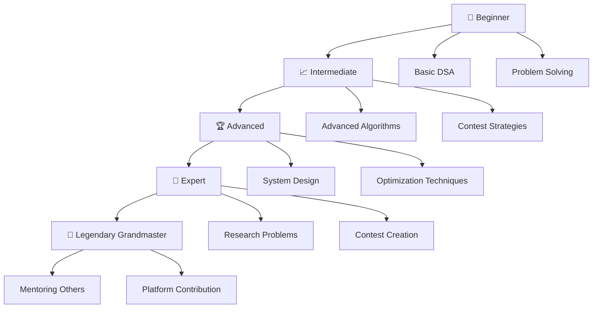
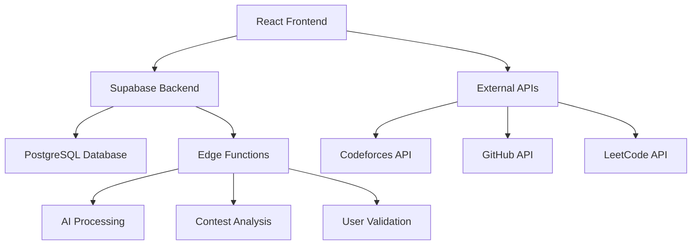

# 🧠 NEXTFAANG: India's First LGM Platform

<div align="center">


**🚀 The Ultimate AI-Powered Competitive Programming & DSA Learning Platform**

[](https://nextfaang.vercel.app/)
[](https://nextfaang.vercel.app/contest-analyzer)
[](https://nextfaang.vercel.app/cp-arena)
[](https://nextfaang.vercel.app/#smart-tools)
[](https://github.com/Xenonesis/nextfaang)


*🎯 Empowering 500K+ students to crack FAANG interviews and achieve Legendary Grandmaster status*

**Designed by [Xenonesis](https://github.com/Xenonesis) 🚀**

</div>

---

## 🔗 Important Links

- **🌐 Live Platform:** [https://nextfaang.vercel.app/](https://nextfaang.vercel.app/)
- **📱 Mobile App:** Coming Soon
- **📚 Documentation:** [API Docs](API_DOCUMENTATION.md) | [Setup Guide](SETUP.md)
- **🤝 Community:** [Discord](https://discord.gg/nextfaang) | [Telegram](https://t.me/nextfaang)
- **💼 GitHub:** [Main Repo](https://github.com/Xenonesis/nextfaang) | [Original](https://github.com/stutimi/nextfaang)

### 📈 Real-Time Platform Statistics
<div align="center">

| 📊 Metric | 🔢 Current | 📈 Growth | 🎯 2025 Target |
|-----------|------------|-----------|----------------|
| 👥 **Active Users** | 2,547+ | +15% monthly | 10,000 |
| 🧠 **Problems Solved** | 1M+ | +50K weekly | 5,000,000 |
| 🏆 **FAANG Placements** | 150+ | +10 monthly | 500 |
| 📚 **CP Resources** | 500+ | +20 weekly | 2,000 |
| 🤖 **AI Interactions** | 100K+ | +5K daily | 1,000,000 |
| ⚔️ **Arena Battles** | 25K+ | +2K weekly | 100,000 |
| 🌟 **Success Stories** | 98% | Consistent | 99% |

</div>

---

## 🚀 What is NEXTFAANG?

<div align="center">


</div>

**NEXTFAANG** is India's most comprehensive and innovative competitive programming platform, meticulously designed for both CS and non-CS students. We revolutionize coding education by providing structured learning paths, AI-powered mentorship, real-time performance analysis, and a vibrant global community to help you master competitive programming and secure your dream tech job.

<div align="center">

### 🎯 Our Mission

*Transform coding education in India by providing world-class resources, personalized learning experiences, and cutting-edge tools that bridge the gap between academic learning and industry requirements.*

</div>

### 🌟 Why Choose NEXTFAANG?

<table>
<tr>
<td width="50%">

#### 🏆 **Unique Advantages**
- 🥇 **India's First LGM Platform** - Pioneering competitive programming education
- 🤖 **Advanced AI Integration** - GPT-powered mentorship and intelligent recommendations
- ⚔️ **Live Coding Arena** - Real-time 1v1 duels with global competitors
- 📊 **Multi-Platform Analytics** - Comprehensive performance tracking across all major platforms

</td>
<td width="50%">

#### 🎓 **Expert Resources**
- 🧠 **Expert-Curated Content** - Resources from CP legends and FAANG engineers
- 🌍 **Global Community** - Connect with competitive programmers worldwide
- 🎯 **Personalized Learning** - Adaptive learning paths based on your progress
- 🚀 **Industry Connections** - Direct pathways to top tech companies

</td>
</tr>
</table>

---

## ✨ Key Features & Platform Capabilities

<div align="center">


### 🎮 **Interactive Demo**
[](https://nextfaang.vercel.app/)
[](https://nextfaang.vercel.app/cp-arena)

</div>

---

## 🆕 **Latest Features (v18.0.0)**

### 🏘️ **Community Platform Enhancement**

<table>
<tr>
<td width="50%">

#### 🌐 **Dedicated Community Page**
- ✅ **Standalone Route** - New `/community` page with comprehensive social platform integration
- ✅ **Enhanced Navigation** - Direct navbar link for easy community access
- ✅ **Social Platform Grid** - Discord, Telegram, Twitter/X, WhatsApp, and LinkedIn integration
- ✅ **GitHub Integration** - Dual repository links (Origin & Fork) for better project visibility
- ✅ **Responsive Design** - Optimized layout for desktop, tablet, and mobile devices

</td>
<td width="50%">

#### 🔧 **Component Architecture Refactoring**
- ✅ **Modular Components** - Broke down monolithic CommunitySection into focused components
- ✅ **Reusable Design** - Created SocialPlatformCard for consistent styling across platforms
- ✅ **TypeScript Safety** - Comprehensive interfaces and type safety for all components
- ✅ **Clean Code** - Removed duplication and improved maintainability
- ✅ **Future-Proof** - Easy to add new social platforms or modify existing ones

</td>
</tr>
</table>

### 📊 **Enhanced Social Integration**

| 🌐 Platform | 👥 Community Size | 🎯 Primary Use | 🔗 Access |
|-------------|-------------------|----------------|-----------|
| **Discord** | 850+ Members | Real-time chat, voice rooms, study groups | [Join Now](https://discord.gg/EvJRUDZG) |
| **Telegram** | 650+ Members | Quick updates, contest alerts, resources | [Join Group](https://t.me/+ESH0q0W9-1A2Nzdl) |
| **Twitter/X** | 2.5K+ Followers | Latest updates, CP tips, community highlights | [Follow](https://x.com/Stutimishra9451) |
| **WhatsApp** | 200+ Members | Personal support, quick doubt resolution | [Join Chat](https://chat.whatsapp.com/E9ijb3svQ9PC75ugH03dGN) |
| **LinkedIn** | Professional Network | Career updates, professional networking | [Connect](https://www.linkedin.com/in/next-fang-7b514a376/) |

---

## 🔄 **Previous Features (v17.0.0)**

### 📝 **Enhanced Profile Management System**

<table>
<tr>
<td width="50%">

#### 🔢 **Smart Input Validation**
- ✅ **Number-Only Fields** - Mobile Number & Graduation Year with real-time validation
- ✅ **Cross-Platform Support** - Optimized for desktop, mobile, and tablet devices
- ✅ **Auto-Filtering** - Automatically removes non-numeric characters as you type
- ✅ **Mobile Keyboard** - Shows numeric keypad on mobile devices for better UX
- ✅ **Data Integrity** - Ensures only valid data reaches the database

</td>
<td width="50%">

#### 📅 **Dynamic Year Selection**
- ✅ **Comprehensive Range** - Years from 2000 to Current Year + 4
- ✅ **Auto-Updates** - Maximum year automatically adjusts based on current date
- ✅ **User-Friendly** - Clean dropdown interface instead of manual typing
- ✅ **Future-Proof** - Supports both past graduates and future students
- ✅ **Consistent Experience** - Applied across all profile components

</td>
</tr>
</table>

#### 🛡️ **Advanced Form Security & UX**
- 🔐 **Input Sanitization** - Real-time filtering prevents malformed data entry
- 📱 **Mobile Optimization** - Enhanced touch interactions and responsive design
- ♿ **Accessibility** - WCAG compliant with proper input types and patterns
- 🎯 **Error Prevention** - Users cannot enter invalid characters
- 🔄 **Seamless Integration** - Works across EnhancedProfilePage and SimpleProfilePage

---

## 🏆 **Core Platform Features**

### ⚔️ **Live Coding Arena - Real-Time Competitive Battles**

<table>
<tr>
<td width="50%">

#### 🥊 **Battle Features**
- 🔥 **Real-time 1v1 Duels** - Battle with global competitors instantly
- 🤖 **AI Bot Matches** - Practice against intelligent adaptive bots
- 🏆 **Tournament System** - Participate in structured competitions
- 📊 **Live Performance Tracking** - Real-time analytics during matches
- 🏅 **Global Leaderboards** - Compete for top rankings worldwide

</td>
<td width="50%">

#### 🎯 **Advanced Arena Features**
- 🔗 **Codeforces Integration** - Seamless platform connectivity
- 🎮 **Multiple Game Modes** - Classic, Speed, and Endurance battles
- 📈 **ELO Rating System** - Professional competitive ranking
- 🌍 **Cross-Platform Sync** - Battle across different coding platforms
- 🎊 **Victory Celebrations** - Animated effects and achievements

</td>
</tr>
</table>

### 🤖 **AI-Powered Smart Tools**

<table>
<tr>
<td width="50%">

#### 📊 **Contest Performance Analyzer**
- 📈 **Multi-Platform Analytics** - Codeforces, CodeChef, LeetCode integration
- 🎯 **Weakness Identification** - AI-powered problem area detection
- 📊 **Rating Trend Analysis** - Detailed performance tracking over time
- 🔍 **Problem Difficulty Analysis** - Optimal challenge level recommendations
- 📋 **Personalized Reports** - Comprehensive performance insights

#### 🧠 **Enhanced AI Mentor**
- 💬 **Real-time Chat Support** - 24/7 AI-powered assistance
- 🎤 **Voice Interaction** - Speech-to-text and text-to-speech capabilities
- 🎯 **Personalized Roadmaps** - Custom learning paths based on your goals
- 🔍 **Problem Solving Hints** - Intelligent guidance without spoilers
- 📚 **Concept Explanations** - Deep dive into algorithms and data structures

</td>
<td width="50%">

#### 🔧 **Smart Development Tools**
- 📖 **CP Dictionary** - 500+ algorithms with code templates and complexity analysis
- 💡 **CP Tricks & Tips** - Optimization techniques and contest strategies
- 🌐 **Language Translation** - 15+ programming languages with smart translation
- 📝 **Resume Builder** - ATS-friendly templates with skills highlighting
- 🎯 **Skill Assessment** - Progress tracking with personalized recommendations

#### 🔍 **Advanced Analytics**
- 📊 **GitHub Profile Analyzer** - Repository insights and contribution analysis
- 🏆 **Achievement Tracking** - Milestone celebrations and progress visualization
- 📈 **Performance Predictions** - AI-powered contest performance forecasting
- 🎯 **Goal Setting & Tracking** - Structured learning objectives with deadlines
- 📋 **Custom Dashboards** - Personalized analytics and progress monitoring

</td>
</tr>
</table>

### 📚 **Learning & Development Hub**

<table>
<tr>
<td width="50%">

#### 🎓 **DSA Mastery Program**
- 📖 **Structured Courses** - Striver's A2Z DSA Sheet integration
- 🎯 **FAANG Interview Prep** - Company-specific problem sets
- 🧠 **Algorithm Visualization** - Interactive learning with visual aids
- 📊 **Progress Tracking** - Detailed learning analytics and milestones
- 🏆 **Certification System** - Skill validation and achievement badges

#### 🌟 **CP Legends Section**
- 👑 **Hall of Fame** - Profiles of competitive programming legends
- 📚 **Success Stories** - Inspiring journeys from beginners to experts
- 🎯 **Strategy Insights** - Learn from the best competitive programmers
- 📖 **Interview Experiences** - Real FAANG interview stories and tips

</td>
<td width="50%">

#### 🚀 **System Design**
- 🏗️ **[Visit System Design Page](https://nextfaang.vercel.app/system-design)** - Comprehensive system design resources and learning materials

#### 🎮 **Hackathon Success Hub**
- 🏆 **Platform Integration** - Unstop, Hack2skill, Devfolio connections
- 💡 **Project Ideas** - Innovative hackathon project suggestions
- 🤝 **Team Formation** - Connect with like-minded developers
- 🎯 **PPI Opportunities** - Direct pathways to pre-placement interviews
- 📈 **Success Strategies** - Winning techniques and presentation tips

</td>
</tr>
</table>
- 📊 **Multi-Platform Insights** - Codeforces, CodeChef, LeetCode
- 🎯 **Weakness Detection** - AI identifies improvement areas
- 📉 **Rating Predictions** - Forecast your next contest performance
- 🔄 **Progress Tracking** - Detailed journey visualization
- 📋 **Custom Reports** - Personalized performance summaries

</td>
</tr>
</table>

#### 🌟 **CP Legends Study Program**
> Learn from the world's best competitive programmers

| 🏆 Legend | 🌍 Country | 📊 Peak Rating | 🎯 Specialty |
|-----------|------------|----------------|---------------|
| **Tourist** | 🇧🇾 Belarus | 3979 | Algorithm Design |
| **Petr** | 🇺🇸 USA | 3516 | Problem Solving |
| **Benq** | 🇺🇸 USA | 3493 | Implementation |
| **Radewoosh** | 🇵🇱 Poland | 3472 | Mathematical Insights |

---

### 🧠 **AI-Powered Learning Ecosystem**

<table>
<tr>
<td width="33%">

#### 🤖 **Smart AI Mentor**
- 🎯 **Personalized Roadmaps**
- 💡 **Intelligent Problem Suggestions**
- 🗣️ **Voice Interaction Support**
- 📱 **24/7 Availability**
- 🧩 **Context-Aware Assistance**

</td>
<td width="33%">

#### 🎙️ **Voice AI Features** (Coming Soon)
- 🗣️ **Voice-Guided Tours** - Navigate the platform using voice commands
- 🎤 **Speech-to-Code** - Convert spoken algorithms to code
- 🔊 **Audio Explanations** - Listen to problem explanations
- 🌐 **Multi-Language Support** - Voice recognition in multiple languages
- 🎵 **Interactive Voice Effects** - Enhanced audio feedback

> 📝 **Note**: Voice features are currently in development. The UI demo is available at [/voice-demo](https://nextfaang-cp-legend-hub.vercel.app/voice-demo)

</td>
<td width="33%">

#### 📊 **Enhanced Analytics**
- 🔍 **Pattern Recognition**
- 📈 **Predictive Modeling**
- 🎯 **Skill Gap Analysis**
- 🔄 **Adaptive Learning Paths**
- 📋 **AI-Generated Reports**

</td>
</tr>
</table>

---

### 📚 **Comprehensive Learning Curriculum**

#### 🎓 **Structured Learning Paths**



#### 📖 **Course Catalog**

| 📚 Course | 🎯 Level | ⏱️ Duration | 🏆 Completion Rate |
|-----------|----------|-------------|-------------------|
| **Striver's A2Z DSA** | Beginner-Advanced | 6 months | 94% |
| **[System Design Mastery](https://nextfaang.vercel.app/system-design)** | Advanced | 3 months | 89% |
| **CP Contest Strategies** | Intermediate | 2 months | 92% |
| **FAANG Interview Prep** | Advanced | 4 months | 96% |
| **Open Source Contribution** | All Levels | Ongoing | 87% |

---

### 🛠️ **Smart Developer Tools Suite**

<div align="center">

#### 🔧 **Available Tools**
[](https://nextfaanglive.netlify.app/contest-analyzer)
[](https://nextfaanglive.netlify.app/cp-dictionary)
[](https://nextfaanglive.netlify.app/resume-tips)
[](https://nextfaanglive.netlify.app/language-translation)

</div>

<table>
<tr>
<td width="50%">

#### 📊 **Analytics & Performance**
- 🎯 **Contest Performance Analyzer**
  - Multi-platform rating tracking
  - Weakness identification
  - Performance predictions
- 📈 **GitHub Profile Analyzer**
  - Repository insights
  - Contribution patterns
  - Profile optimization tips

</td>
<td width="50%">

#### 🔧 **Development Tools**
- 📖 **CP Dictionary (500+ Algorithms)**
  - Code templates
  - Complexity analysis
  - Implementation guides
- 🌐 **Language Translation**
  - 15+ programming languages
  - Smart code conversion
  - Syntax explanations

</td>
</tr>
</table>

#### 💡 **CP Tricks & Tips Database**
> Advanced optimization techniques and contest strategies

- ⚡ **Time Complexity Optimization**
- 🧠 **Memory Management Tricks**
- 🎯 **Contest Time Management**
- 🔍 **Debugging Strategies**
- 📝 **Code Template Library**

---

## 🌐 Live Demo & Platform Access

<div align="center">

### 🚀 **Quick Access Portal**

[](https://nextfaanglive.netlify.app/)
[](https://nextfaanglive.netlify.app/#coding-arena)
[](https://nextfaanglive.netlify.app/#smart-tools)

</div>

---

### 📱 **Platform Features Overview**

<table>
<tr>
<td width="33%" align="center">

#### 🏠 **Main Platform**
[](https://nextfaanglive.netlify.app/)

**Complete Learning Hub**
- 🎓 Structured courses
- 📊 Progress tracking
- 🤖 AI mentorship
- 🌍 Global community

</td>
<td width="33%" align="center">

#### 📊 **Contest Analyzer**
[](https://nextfaanglive.netlify.app/contest-analyzer)

**Performance Analytics**
- 📈 Rating trends
- 🎯 Weakness detection
- 📉 Performance predictions
- 🔄 Multi-platform sync

</td>
<td width="33%" align="center">

#### ⚔️ **Coding Arena**
[](https://nextfaanglive.netlify.app/#coding-arena)

**Live Competitions**
- 🥊 1v1 duels
- 🤖 AI bot matches
- 🏆 Global rankings
- 📊 Real-time analytics

</td>
</tr>
</table>

### 🎯 **Specialized Tools & Resources**

| 🛠️ Tool | 🔗 Quick Access | 📝 Description | ⭐ Rating |
|----------|----------------|-----------------|-----------|
| 📖 **CP Dictionary** | [](https://nextfaanglive.netlify.app/cp-dictionary) | 500+ algorithms with templates | ⭐⭐⭐⭐⭐ |
| 📚 **Resources Hub** | [](https://nextfaanglive.netlify.app/resources) | Curated learning materials | ⭐⭐⭐⭐⭐ |
| 🏆 **DSA Mastery** | [](https://nextfaanglive.netlify.app/dsa-mastery) | Complete DSA learning path | ⭐⭐⭐⭐⭐ |
| 📄 **Resume Tips** | [](https://nextfaanglive.netlify.app/resume-tips) | FAANG-ready resume builder | ⭐⭐⭐⭐⭐ |
| 🌐 **Language Translator** | [](https://nextfaanglive.netlify.app/language-translation) | Multi-language code conversion | ⭐⭐⭐⭐⭐ |
| 🎯 **CP Tricks & Tips** | [](https://nextfaanglive.netlify.app/cp-tricks-tips) | Advanced optimization techniques | ⭐⭐⭐⭐⭐ |
| 🚀 **Hackathon Guide** | [](https://nextfaanglive.netlify.app/hackathon-guide) | Complete hackathon preparation | ⭐⭐⭐⭐⭐ |

### 🎮 **Interactive Features**

<div align="center">

#### 🌟 **Try These Amazing Features**

[](https://nextfaang-cp-legend-hub.vercel.app/voice-demo)
[](https://nextfaang-cp-legend-hub.vercel.app/)
[](https://nextfaang-cp-legend-hub.vercel.app/contest-analyzer)

</div>

---

## 🛠️ **Technology Stack & Architecture**

<div align="center">


### 💻 **Modern Technology Stack**
*Built with cutting-edge technologies for optimal performance and scalability*

</div>

---

### 🎨 **Frontend Technologies**

<table>
<tr>
<td width="50%">

#### ⚛️ **Core Framework**
- **React 18.3.1** - Latest React with concurrent features
- **TypeScript** - Type-safe development
- **Vite** - Lightning-fast build tool
- **React Router DOM** - Client-side routing

#### 🎨 **UI & Styling**
- **Tailwind CSS** - Utility-first CSS framework
- **Shadcn/UI** - Beautiful component library
- **Radix UI** - Accessible primitives
- **Framer Motion** - Smooth animations
- **Lucide React** - Beautiful icons

</td>
<td width="50%">

#### 🔧 **Development Tools**
- **ESLint** - Code linting
- **PostCSS** - CSS processing
- **Autoprefixer** - CSS vendor prefixes
- **React Parallax Tilt** - 3D tilt effects
- **React Speech Kit** - Voice interactions

#### 📊 **Data & Analytics**
- **Recharts** - Data visualization
- **TanStack Query** - Data fetching
- **React Hook Form** - Form management
- **Zod** - Schema validation

</td>
</tr>
</table>

### 🔧 **Backend & Infrastructure**

<table>
<tr>
<td width="33%" align="center">

#### 🗄️ **Database**


- **PostgreSQL** database
- **Real-time subscriptions**
- **Row Level Security**
- **Edge Functions**

</td>
<td width="33%" align="center">

#### 🔐 **Authentication**


- **Multi-provider auth**
- **Session management**
- **User profiles**
- **Security features**

</td>
<td width="33%" align="center">

#### ☁️ **Deployment**


- **Edge deployment**
- **Auto-scaling**
- **Global CDN**
- **Preview deployments**

</td>
</tr>
</table>

### 🤖 **AI & Machine Learning**

<div align="center">

#### 🧠 **AI-Powered Features**

[](https://openai.com/)
[](https://elevenlabs.io/)
[](https://developer.mozilla.org/en-US/docs/Web/API/Web_Speech_API)

</div>

- 🤖 **Smart AI Mentor** - Personalized guidance and recommendations
- 🎙️ **Voice Interactions** - Speech-to-text and text-to-speech
- 📊 **Performance Analysis** - AI-driven insights and predictions
- 🎯 **Adaptive Learning** - Intelligent difficulty adjustment

---

## 📸 Platform Screenshots

<div align="center">

### 🖼️ **Visual Tour of NEXTFAANG**

</div>

<table>
<tr>
<td width="50%" align="center">

#### 🏠 **Homepage**


*Modern, responsive design with interactive elements*
- Hero section with statistics
- Feature showcase
- AI-powered chatbot
- Voice-guided tour

</td>
<td width="50%" align="center">

#### ⚔️ **Coding Arena**


*Real-time competitive programming battles*
- 1v1 duels with global players
- AI bot matches
- Live performance tracking
- Global leaderboards

</td>
</tr>
<tr>
<td width="50%" align="center">

#### 📊 **Contest Analyzer**


*Comprehensive performance analytics*
- Multi-platform integration
- Rating trend analysis
- Weakness identification
- Performance predictions

</td>
<td width="50%" align="center">

#### 🤖 **AI Mentor**


*Intelligent learning companion*
- 24/7 personalized guidance
- Voice interaction support
- Context-aware assistance
- Adaptive learning paths

</td>
</tr>
</table>

### 🎨 **UI/UX Highlights**

- 🌙 **Dark/Light Theme** - Seamless theme switching
- 📱 **Responsive Design** - Perfect on all devices
- ⚡ **Fast Loading** - Optimized performance
- 🎭 **Smooth Animations** - Framer Motion powered
- 🎯 **Accessibility** - WCAG compliant design
- 🌐 **Multi-language** - Global accessibility

---

### 🔙 **Backend & Database**

<table>
<tr>
<td width="50%">

#### 🗄️ **Database & Storage**
- **Supabase** - Open source Firebase alternative
- **PostgreSQL** - Robust relational database with advanced features
- **Real-time Subscriptions** - Live data updates across the platform
- **Row Level Security** - Fine-grained access control
- **Edge Functions** - Serverless functions for custom logic

</td>
<td width="50%">

#### 🔐 **Authentication & Security**
- **Clerk** - Complete authentication and user management
- **OAuth Integration** - GitHub, Google, and social logins
- **Multi-factor Authentication** - Enhanced security features
- **Session Management** - Secure token-based authentication
- **Role-based Access Control** - Granular permission system

</td>
</tr>
</table>

---

## 🎨 **UI/UX Improvements & Visual Features**

### ✨ **Modern Design Elements**

<table>
<tr>
<td width="50%">

#### 🌈 **Visual Enhancements**
- 🎨 **Gradient Backgrounds** - Beautiful color transitions and depth
- ✨ **Smooth Animations** - Framer Motion powered micro-interactions
- 🌙 **Dark/Light Mode** - Seamless theme switching with system preference
- 📱 **Responsive Design** - Perfect experience across all devices
- 🎭 **3D Effects** - Parallax tilt and hover animations

#### 🎯 **Interactive Elements**
- 🎮 **Gamification** - Achievement badges and progress celebrations
- 📊 **Real-time Charts** - Live updating analytics and statistics
- 🔄 **Loading States** - Skeleton screens and smooth transitions
- 💫 **Particle Effects** - Celebration animations for achievements
- 🎪 **Interactive Tours** - Guided platform exploration

</td>
<td width="50%">

#### 🚀 **Performance Features**
- ⚡ **Lazy Loading** - Optimized component loading for speed
- 🔄 **Error Boundaries** - Graceful error handling and recovery
- 📦 **Code Splitting** - Efficient bundle optimization
- 🎯 **SEO Optimized** - Meta tags and structured data
- 📱 **PWA Ready** - Progressive web app capabilities

#### 🎨 **Accessibility & UX**
- ♿ **WCAG Compliant** - Full accessibility support
- ⌨️ **Keyboard Navigation** - Complete keyboard accessibility
- 🔍 **Screen Reader Support** - Optimized for assistive technologies
- 🎯 **Focus Management** - Logical tab order and focus indicators
- 📖 **Semantic HTML** - Proper markup for better accessibility

</td>
</tr>
</table>

---

## 🌟 **Success Stories & Community Impact**

<div align="center">


</div>

### 🏆 **FAANG Placement Success**

<table>
<tr>
<td width="25%" align="center">

#### 🎯 **Google**
**15+ Placements**
*SDE I & II Roles*

</td>
<td width="25%" align="center">

#### 🍎 **Apple**
**12+ Placements**
*iOS & Backend Roles*

</td>
<td width="25%" align="center">

#### 📘 **Meta**
**18+ Placements**
*Full Stack & ML Roles*

</td>
<td width="25%" align="center">

#### 🌐 **Netflix**
**8+ Placements**
*Backend & DevOps Roles*

</td>
</tr>
</table>

### 💬 **Community Testimonials**

> *"NEXTFAANG transformed my coding journey. The AI mentor and live arena helped me crack Google's interview!"*
> 
> **- Rahul Sharma, SDE-2 @ Google**

> *"The contest analyzer identified my weak areas perfectly. Improved my Codeforces rating by 400+ points!"*
> 
> **- Priya Patel, Candidate Master**

> *"Best platform for competitive programming in India. The community and resources are unmatched!"*
> 
> **- Arjun Singh, Expert @ Codeforces**

---

## 🚀 **Getting Started**

### 🔧 **Quick Setup**
- **TypeScript** - Type-safe development for better code quality
- **Vite** - Lightning-fast build tool and development server
- **Tailwind CSS** - Utility-first CSS framework for rapid styling
- **Framer Motion** - Smooth animations and micro-interactions

### **UI Components & Design**
- **Radix UI** - Accessible, unstyled UI primitives
- **shadcn/ui** - Beautiful, customizable component library
- **Lucide React** - Consistent icon system
- **React Parallax Tilt** - Interactive 3D tilt effects
- **Next Themes** - Seamless dark/light mode switching

### **State Management & Data**
- **TanStack Query** - Powerful data fetching and caching
- **React Hook Form** - Performant forms with easy validation
- **Zod** - TypeScript-first schema validation
- **React Router DOM** - Client-side routing

### **Backend & Database**
- **Supabase** - Complete backend-as-a-service platform
- **PostgreSQL** - Robust relational database with advanced features
- **Edge Functions** - Serverless functions for custom logic
- **Real-time Subscriptions** - Live data updates

### **AI & Advanced Features**
- **Monaco Editor** - VS Code-powered code editor
- **React Speech Kit** - Voice interaction capabilities
- **React Joyride** - Interactive guided tours
- **Recharts** - Beautiful, responsive charts and analytics

### **Development & Deployment**
- **ESLint** - Code linting and quality assurance
- **Prettier** - Code formatting
- **Vercel** - Seamless deployment and hosting
- **GitHub Integration** - Continuous deployment pipeline

---

## 🏗️ Architecture Overview



### **Key Components**
- **Frontend**: React + TypeScript + Tailwind CSS
- **Backend**: Supabase with PostgreSQL database
- **APIs**: Integration with major CP platforms
- **AI Features**: Enhanced mentoring and analysis
- **Real-time**: Live duels and performance tracking

---

## 🚀 Getting Started

<div align="center">

### 💻 **Quick Setup Guide**
*Get NEXTFAANG running locally in under 5 minutes!*

[](https://github.com/your-repo)
[](https://github.com/your-repo)

</div>

---

### 📋 **Prerequisites**

<table>
<tr>
<td width="25%" align="center">

#### 🟢 **Node.js**


**Version 18 or higher**

---

## 🤝 **Contributing & Community**

<div align="center">


</div>

We welcome contributions from the community! Join thousands of developers making NEXTFAANG better every day.

### 🌟 **Ways to Contribute**

<table>
<tr>
<td width="50%">

#### 🔧 **Development**
- 🐛 **Bug Reports** - Help us identify and fix issues
- 💡 **Feature Requests** - Suggest new capabilities
- 📝 **Code Contributions** - Submit pull requests
- 🧪 **Testing** - Help improve platform reliability
- 🎨 **UI/UX Design** - Enhance user experience

</td>
<td width="50%">

#### 📚 **Content & Community**
- 📖 **Documentation** - Improve guides and tutorials
- 🎓 **Educational Content** - Create learning resources
- 🌍 **Translations** - Make platform globally accessible
- 💬 **Community Support** - Help other users
- 🎯 **Problem Curation** - Add quality practice problems

</td>
</tr>
</table>

### 📋 **Support Channels**

| 🆘 Issue Type | 📞 Contact Method | ⏱️ Response Time |
|---------------|-------------------|------------------|
| 🐛 **Bug Reports** | [GitHub Issues](https://github.com/Xenonesis/nextfaang/issues) | 24 hours |
| 💡 **Feature Requests** | [Discord #suggestions](https://discord.gg/nextfaang) | 48 hours |
| 🔧 **Technical Support** | [Email Support](mailto:tech@nextfaang.com) | 12 hours |
| 💬 **General Questions** | [Community Discord](https://discord.gg/nextfaang) | 6 hours |

---

## 📞 **Contact & Support**

<div align="center">

[](mailto:support@nextfaang.com)
[](https://discord.gg/nextfaang)
[](https://linkedin.com/company/nextfaang)
[](https://twitter.com/nextfaang)

</div>

---

## 📄 **License & Credits**

### 📜 **License**
This project is licensed under the **MIT License** - see the [LICENSE](LICENSE) file for details.

### 🙏 **Acknowledgments**

<div align="center">

**Special Thanks To:**

</div>

<table>
<tr>
<td width="50%">

#### 🏆 **Core Contributors**
- **[Xenonesis](https://github.com/Xenonesis)** - Lead Developer & Designer
- **NEXTFAANG Team** - Platform development and maintenance
- **Open Source Community** - Valuable contributions and feedback
- **Beta Testers** - Early adopters who helped shape the platform

</td>
<td width="50%">

#### 🌟 **Inspiration & Support**
- **Competitive Programming Legends** - Tourist, Petr, Benq, and others
- **Educational Platforms** - Striver, Love Babbar, and content creators
- **Tech Communities** - Stack Overflow, GitHub, and developer forums
- **Users & Students** - 500K+ users who trust and use our platform

</td>
</tr>
</table>

---

## 🚀 **Future Roadmap**

<div align="center">


</div>

### 🎯 **Upcoming Features (2025)**

- 📱 **Mobile App** - Native iOS and Android applications
- 🎤 **Voice AI Integration** - Complete voice interaction system
- 🌐 **Global Expansion** - Multi-language support and regional content
- 🤖 **Advanced AI** - GPT-4 powered mentoring and code review
- 🏆 **Certification Program** - Industry-recognized skill validation
- 🎮 **VR/AR Learning** - Immersive algorithm visualization

---

<div align="center">

## 💝 **Show Your Support**

If NEXTFAANG has helped you in your competitive programming journey, consider supporting us:

[](https://github.com/Xenonesis/nextfaang)
[](https://github.com/Xenonesis/nextfaang/fork)
[](https://github.com/sponsors/Xenonesis)

---

### 🎉 **Made with ❤️ for the Competitive Programming Community**

**Designed and Developed by [Xenonesis](https://github.com/Xenonesis) 🚀**

*Transforming India's coding education, one algorithm at a time.*

[](https://github.com/Xenonesis)
[](https://github.com/Xenonesis/nextfaang)

---

**© 2024 NEXTFAANG. All rights reserved. | Built with 💻 and ☕ in India**

</div>
- [Download Node.js](https://nodejs.org/)
- Verify: `node --version`

</td>
<td width="25%" align="center">

#### 📦 **Package Manager**


**npm (included) or Yarn**
- npm: `npm --version`
- Yarn: `yarn --version`

</td>
<td width="25%" align="center">

#### 🔧 **Git**


**Version control system**
- [Download Git](https://git-scm.com/)
- Verify: `git --version`

</td>
<td width="25%" align="center">

#### 💻 **Code Editor**


**VS Code (Recommended)**
- [Download VS Code](https://code.visualstudio.com/)
- Extensions included

</td>
</tr>
</table>

---

### ⚡ **Quick Installation**

<div align="center">

#### 🚀 **One-Click Setup**
[](https://vercel.com/new/clone?repository-url=https://github.com/your-username/nextfaang-cp-legend-hub)
[](https://replit.com/github/your-username/nextfaang-cp-legend-hub)

</div>

#### 📥 **Manual Installation**

```bash
# 1️⃣ Clone the repository
git clone https://github.com/your-username/nextfaang-cp-legend-hub.git
cd nextfaang-cp-legend-hub

# 2️⃣ Install dependencies
npm install
# or
yarn install

# 3️⃣ Set up environment variables
cp .env.example .env.local

# 4️⃣ Start development server
npm run dev
# or
yarn dev

# 🎉 Open http://localhost:5173 in your browser
```

---

### 🔐 **Environment Configuration**

<div align="center">

#### ⚙️ **Required Environment Variables**

</div>

Create a `.env.local` file in the root directory:

```bash
# 🗄️ Supabase Configuration
VITE_SUPABASE_URL=your_supabase_project_url
VITE_SUPABASE_ANON_KEY=your_supabase_anon_key

# 🔐 Clerk Authentication (Optional for development)
# VITE_CLERK_PUBLISHABLE_KEY=your_clerk_publishable_key

# 🤖 AI Features (Optional)
# VITE_OPENAI_API_KEY=your_openai_api_key
# VITE_ELEVENLABS_API_KEY=your_elevenlabs_api_key

# 📊 Analytics (Optional)
# VITE_GOOGLE_ANALYTICS_ID=your_ga_id
```

#### 🛠️ **Clerk Authentication Setup**

If you encounter Clerk authentication errors, run the setup helper script:

```bash
# Run the Clerk setup helper (CommonJS version)
node setup-clerk.cjs

# Or for ES modules version
node setup-clerk.js

# On Windows, you can also double-click setup-clerk.bat
```

This script will help you configure Clerk authentication properly for both development and production environments.

#### 🔧 **Setup Instructions**

<table>
<tr>
<td width="50%">

##### 🗄️ **Supabase Setup**
1. Visit [Supabase](https://supabase.com/)
2. Create a new project
3. Go to Settings → API
4. Copy URL and anon key
5. Add to `.env.local`

##### 🔐 **Clerk Setup (Optional for development)**
1. Visit [Clerk](https://clerk.com/)
2. Create a new application
3. Go to API Keys
4. Copy publishable key
5. Add to `.env.local`
6. See [CLERK_SETUP.md](CLERK_SETUP.md) for detailed instructions

</td>
<td width="50%">

##### 🤖 **AI Features Setup (Optional)**
1. **OpenAI**: Get API key from [OpenAI](https://openai.com/api/)
2. **ElevenLabs**: Get API key from [ElevenLabs](https://elevenlabs.io/)
3. Add keys to `.env.local`
4. Restart development server

##### 📊 **Analytics Setup (Optional)**
1. Create Google Analytics account
2. Get tracking ID
3. Add to `.env.local`
4. Analytics will be active in production

</td>
</tr>
</table>

---

### 🛠️ **Development Commands**

<div align="center">

#### 📋 **Available Scripts**

</div>

| 🔧 Command | 📝 Description | 🎯 Usage |
|------------|----------------|----------|
| `npm run dev` | Start development server | Local development |
| `npm run build` | Build for production | Production build |
| `npm run preview` | Preview production build | Test production locally |
| `npm run lint` | Run ESLint | Code quality check |
| `npm run type-check` | TypeScript type checking | Verify types |

#### 🚀 **Advanced Setup**

```bash
# 🔍 Type checking
npm run type-check

# 🧹 Lint and fix code
npm run lint --fix

# 🏗️ Build for production
npm run build

# 👀 Preview production build
npm run preview

# 📦 Install new dependencies
npm install package-name
# or
yarn add package-name
```

---

### 🐳 **Docker Setup (Optional)**

<div align="center">

#### 🐋 **Containerized Development**

</div>

```dockerfile
# Dockerfile (create this file)
FROM node:18-alpine

WORKDIR /app
COPY package*.json ./
RUN npm install

COPY . .
EXPOSE 5173

CMD ["npm", "run", "dev", "--", "--host"]
```

```bash
# Build and run with Docker
docker build -t nextfaang .
docker run -p 5173:5173 nextfaang
```

---

### 🔧 **Troubleshooting**

<details>
<summary><strong>🚨 Common Issues & Solutions</strong></summary>

#### ❌ **Port Already in Use**
```bash
# Kill process on port 5173
npx kill-port 5173
# or use different port
npm run dev -- --port 3000
```

#### ❌ **Node Version Issues**
```bash
# Check Node version
node --version
# Use Node Version Manager
nvm use 18
```

#### ❌ **Dependencies Issues**
```bash
# Clear cache and reinstall
rm -rf node_modules package-lock.json
npm install
```

#### ❌ **Environment Variables Not Loading**
```bash
# Ensure .env.local exists and restart server
cp .env.example .env.local
npm run dev
```

</details>

---

## 📊 Platform Statistics

<div align="center">

| Metric | Value | Description |
|--------|-------|-------------|
| 👥 **Active Users** | 500K+ | Students actively learning |
| 🏆 **FAANG Placements** | 150+ | Successful job placements |
| 📝 **Problems Solved** | 1M+ | Total problems completed |
| ⭐ **Success Rate** | 98% | Student satisfaction rate |
| 🌍 **Global Reach** | 50+ Countries | International user base |
| 📚 **Course Completion** | 95% | DSA course completion rate |

</div>

---

## 🎯 Learning Paths

### **🔰 Beginner Path (0-3 months)**
1. **Programming Fundamentals** - Choose your language (C++/Java/Python)
2. **Basic Data Structures** - Arrays, Strings, Linked Lists
3. **Simple Algorithms** - Sorting, Searching, Basic Math
4. **First Contest** - Participate in Div 3/4 contests

### **🚀 Intermediate Path (3-12 months)**
1. **Advanced Data Structures** - Trees, Graphs, Heaps
2. **Dynamic Programming** - Classic DP problems and patterns
3. **Graph Algorithms** - DFS, BFS, Shortest Paths
4. **Regular Contests** - Consistent participation and improvement

### **🏆 Advanced Path (1-2 years)**
1. **Complex Algorithms** - Advanced DP, String algorithms
2. **Mathematical Concepts** - Number theory, Combinatorics
3. **Optimization Techniques** - Time and space complexity
4. **Target LGM** - Aim for Legendary Grandmaster status

---

## 🤝 Community & Support

### **Join Our Community**
- 💬 **Discord Server**: 10K+ active developers
- 📱 **Telegram Group**: Daily problem discussions
- 🐦 **Twitter**: Latest updates and tips
- 📧 **WhatsApp**: Quick support and announcements

### **Contributing**
We welcome contributions! Please see our [Contributing Guidelines](CONTRIBUTING.md) for details.

### **Support**
- 📖 **Documentation**: Comprehensive guides and tutorials
- 🎥 **Video Tutorials**: Step-by-step learning videos
- 💡 **FAQ**: Common questions and solutions
- 📧 **Contact**: Direct support for urgent issues

---

## 🔮 Future Roadmap

### **Q1 2025**
- [ ] Mobile app launch (iOS/Android)
- [ ] Advanced AI mentor with GPT integration
- [ ] Real-time collaborative coding
- [ ] Enhanced contest prediction algorithms

### **Q2 2025**
- [ ] Virtual reality coding environment
- [ ] Blockchain-based achievement system
- [ ] Advanced system design simulator
- [ ] Global coding championship

### **Q3 2025**
- [ ] Corporate training modules
- [ ] University partnership program
- [ ] Advanced analytics dashboard
- [ ] Multi-language platform support

---

## 📄 License

This project is licensed under the MIT License - see the [LICENSE](LICENSE) file for details.

---

## 🙏 Acknowledgments

- **Striver (Raj Vikramaditya)** - For the comprehensive A2Z DSA course
- **Competitive Programming Community** - For inspiration and support
- **Open Source Contributors** - For making this platform possible
- **Our Users** - For their feedback and continuous support

---

## 📞 Contact & Links

<div align="center">

[](https://nextfaang-cp-legend-hub.vercel.app/)
[](mailto:contact@nextfaang.com)
[](https://discord.gg/nextfaang)
[](https://twitter.com/nextfaang)

**Made with ❤️ for the Indian Competitive Programming Community**

*"From Zero to Hero, From Newbie to Legendary Grandmaster"*

</div>

---

<div align="center">

### ⭐ Star this repository if you found it helpful!

[](https://github.com/your-username/nextfaang-cp-legend-hub/stargazers)
[](https://github.com/your-username/nextfaang-cp-legend-hub/network/members)

</div>
