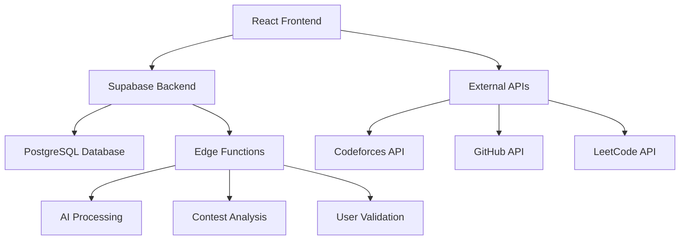

# 🧠 NEXTFAANG: India's First LGM Platform

<div align="center">


**The Ultimate Competitive Programming & DSA Learning Platform**

[](https://nextfaang-cp-legend-hub.vercel.app/)
[](https://github.com/your-repo)
[](LICENSE)

*Empowering 500K+ students to crack FAANG interviews and achieve Legendary Grandmaster status*

</div>

---

## 🚀 What is NEXTFAANG?

NEXTFAANG is India's most comprehensive competitive programming platform designed for both CS and non-CS students. We provide structured learning paths, AI-powered mentorship, real-time performance analysis, and a vibrant community to help you master competitive programming and land your dream tech job.

### 🎯 Our Mission
Transform coding education in India by providing world-class resources, personalized learning experiences, and cutting-edge tools that bridge the gap between academic learning and industry requirements.

---

## ✨ Key Features

### 🏆 **Competitive Programming Excellence**
- **Complete CP Journey**: From beginner to Legendary Grandmaster (LGM)
- **Live Coding Arena**: Real-time 1v1 duels and bot matches with Codeforces integration
- **Performance Analytics**: Deep insights into your coding patterns and progress
- **Contest Integration**: Seamless connection with Codeforces, CodeChef, LeetCode
- **CP Legends Study**: Learn from the best - Tourist, Petr, Benq, and more

### 🧠 **AI-Powered Learning**
- **Smart AI Mentor**: 24/7 personalized guidance and problem recommendations
- **Voice AI Tour**: Interactive voice-guided platform exploration
- **Intelligent Chatbot**: Instant answers to your coding questions
- **Adaptive Learning**: AI adjusts difficulty based on your progress
- **Enhanced Performance Analyzer**: Multi-platform analytics with AI insights

### 📚 **Comprehensive Curriculum**
- **Striver's A2Z DSA Course**: 180+ handpicked problems with video solutions
- **System Design Mastery**: FAANG-level system design preparation
- **Interview Preparation**: Curated resources for top tech companies
- **Open Source Contributions**: Learn through real-world projects
- **Hackathon Guide**: Complete preparation for competitive hackathons

### 🛠️ **Smart Developer Tools**
- **Contest Performance Analyzer**: Multi-platform performance insights
- **CP Dictionary**: 500+ algorithms with code templates and complexity analysis
- **GitHub Profile Analyzer**: Optimize your developer profile
- **Resume Builder**: ATS-friendly tech resume templates
- **Language Translation**: Multi-language support for global accessibility
- **CP Tricks & Tips**: Advanced techniques and optimization strategies

---

## 🌐 Live Demo & Platform Access

| Platform | Link | Description |
|----------|------|-------------|
| 🌐 **Live Demo** | [NEXTFAANG Platform](https://nextfaang-cp-legend-hub.vercel.app/) | Experience the full platform |
| 📊 **Contest Analyzer** | [/contest-analyzer](https://nextfaang-cp-legend-hub.vercel.app/contest-analyzer) | Analyze your CP performance |
| 📚 **Resources Hub** | [/resources](https://nextfaang-cp-legend-hub.vercel.app/resources) | Access all learning materials |
| 🏆 **DSA Mastery** | [/dsa-mastery](https://nextfaang-cp-legend-hub.vercel.app/dsa-mastery) | Master data structures |
| 📖 **CP Dictionary** | [/cp-dictionary](https://nextfaang-cp-legend-hub.vercel.app/cp-dictionary) | Algorithm reference |

---

## 🛠️ Tech Stack

### **Frontend Technologies**
- **React 18** - Modern UI library with hooks and concurrent features
- **TypeScript** - Type-safe development for better code quality
- **Vite** - Lightning-fast build tool and development server
- **Tailwind CSS** - Utility-first CSS framework for rapid styling
- **Framer Motion** - Smooth animations and micro-interactions

### **UI Components & Design**
- **Radix UI** - Accessible, unstyled UI primitives
- **shadcn/ui** - Beautiful, customizable component library
- **Lucide React** - Consistent icon system
- **React Parallax Tilt** - Interactive 3D tilt effects
- **Next Themes** - Seamless dark/light mode switching

### **State Management & Data**
- **TanStack Query** - Powerful data fetching and caching
- **React Hook Form** - Performant forms with easy validation
- **Zod** - TypeScript-first schema validation
- **React Router DOM** - Client-side routing

### **Backend & Database**
- **Supabase** - Complete backend-as-a-service platform
- **PostgreSQL** - Robust relational database with advanced features
- **Edge Functions** - Serverless functions for custom logic
- **Real-time Subscriptions** - Live data updates

### **AI & Advanced Features**
- **Monaco Editor** - VS Code-powered code editor
- **React Speech Kit** - Voice interaction capabilities
- **React Joyride** - Interactive guided tours
- **Recharts** - Beautiful, responsive charts and analytics

### **Development & Deployment**
- **ESLint** - Code linting and quality assurance
- **Prettier** - Code formatting
- **Vercel** - Seamless deployment and hosting
- **GitHub Integration** - Continuous deployment pipeline

---

## 🏗️ Architecture Overview



### **Key Components**
- **Frontend**: React + TypeScript + Tailwind CSS
- **Backend**: Supabase with PostgreSQL database
- **APIs**: Integration with major CP platforms
- **AI Features**: Enhanced mentoring and analysis
- **Real-time**: Live duels and performance tracking

---

## 🚀 Getting Started

### **Prerequisites**
- Node.js 18+ and npm/yarn
- Git for version control
- Modern web browser

### **Installation**

1. **Clone the repository**
```bash
git clone https://github.com/your-username/nextfaang-cp-legend-hub.git
cd nextfaang-cp-legend-hub
```

2. **Install dependencies**
```bash
npm install
# or
yarn install
```

3. **Environment Setup**
```bash
# Copy environment template
cp .env.example .env.local

# Add your Supabase credentials
VITE_SUPABASE_URL=your_supabase_url
VITE_SUPABASE_ANON_KEY=your_supabase_anon_key
```

4. **Start development server**
```bash
npm run dev
# or
yarn dev
```

5. **Open your browser**
Navigate to `http://localhost:5173` to see the application.

### **Building for Production**
```bash
npm run build
npm run preview
```

---

## 📊 Platform Statistics

<div align="center">

| Metric | Value | Description |
|--------|-------|-------------|
| 👥 **Active Users** | 500K+ | Students actively learning |
| 🏆 **FAANG Placements** | 150+ | Successful job placements |
| 📝 **Problems Solved** | 1M+ | Total problems completed |
| ⭐ **Success Rate** | 98% | Student satisfaction rate |
| 🌍 **Global Reach** | 50+ Countries | International user base |
| 📚 **Course Completion** | 95% | DSA course completion rate |

</div>

---

## 🎯 Learning Paths

### **🔰 Beginner Path (0-3 months)**
1. **Programming Fundamentals** - Choose your language (C++/Java/Python)
2. **Basic Data Structures** - Arrays, Strings, Linked Lists
3. **Simple Algorithms** - Sorting, Searching, Basic Math
4. **First Contest** - Participate in Div 3/4 contests

### **🚀 Intermediate Path (3-12 months)**
1. **Advanced Data Structures** - Trees, Graphs, Heaps
2. **Dynamic Programming** - Classic DP problems and patterns
3. **Graph Algorithms** - DFS, BFS, Shortest Paths
4. **Regular Contests** - Consistent participation and improvement

### **🏆 Advanced Path (1-2 years)**
1. **Complex Algorithms** - Advanced DP, String algorithms
2. **Mathematical Concepts** - Number theory, Combinatorics
3. **Optimization Techniques** - Time and space complexity
4. **Target LGM** - Aim for Legendary Grandmaster status

---

## 🤝 Community & Support

### **Join Our Community**
- 💬 **Discord Server**: 10K+ active developers
- 📱 **Telegram Group**: Daily problem discussions
- 🐦 **Twitter**: Latest updates and tips
- 📧 **WhatsApp**: Quick support and announcements

### **Contributing**
We welcome contributions! Please see our [Contributing Guidelines](CONTRIBUTING.md) for details.

### **Support**
- 📖 **Documentation**: Comprehensive guides and tutorials
- 🎥 **Video Tutorials**: Step-by-step learning videos
- 💡 **FAQ**: Common questions and solutions
- 📧 **Contact**: Direct support for urgent issues

---

## 🔮 Future Roadmap

### **Q1 2025**
- [ ] Mobile app launch (iOS/Android)
- [ ] Advanced AI mentor with GPT integration
- [ ] Real-time collaborative coding
- [ ] Enhanced contest prediction algorithms

### **Q2 2025**
- [ ] Virtual reality coding environment
- [ ] Blockchain-based achievement system
- [ ] Advanced system design simulator
- [ ] Global coding championship

### **Q3 2025**
- [ ] Corporate training modules
- [ ] University partnership program
- [ ] Advanced analytics dashboard
- [ ] Multi-language platform support

---

## 📄 License

This project is licensed under the MIT License - see the [LICENSE](LICENSE) file for details.

---

## 🙏 Acknowledgments

- **Striver (Raj Vikramaditya)** - For the comprehensive A2Z DSA course
- **Competitive Programming Community** - For inspiration and support
- **Open Source Contributors** - For making this platform possible
- **Our Users** - For their feedback and continuous support

---

## 📞 Contact & Links

<div align="center">

[](https://nextfaang-cp-legend-hub.vercel.app/)
[](mailto:contact@nextfaang.com)
[](https://discord.gg/nextfaang)
[](https://twitter.com/nextfaang)

**Made with ❤️ for the Indian Competitive Programming Community**

*"From Zero to Hero, From Newbie to Legendary Grandmaster"*

</div>

---

<div align="center">

### ⭐ Star this repository if you found it helpful!

[](https://github.com/your-username/nextfaang-cp-legend-hub/stargazers)
[](https://github.com/your-username/nextfaang-cp-legend-hub/network/members)

</div>